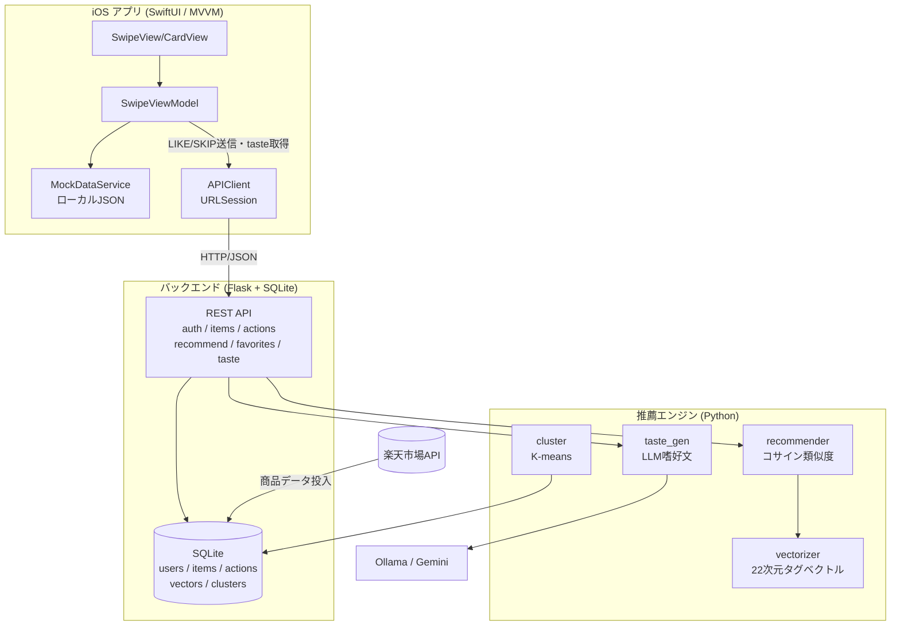

# Swipe Fashion AI — スワイプ型AIファッションレコメンド

商品画像を **右スワイプ（LIKE）／左スワイプ（SKIP）** で評価するだけで、ユーザーの好みを学習し、パーソナライズされたファッションをおすすめするシステムです。

**iOSアプリ（SwiftUI）＋ REST API（Flask）＋ 推薦エンジン（scikit-learn）** の3層構成で、商品データは楽天市場APIから取得しています。

> 本READMEは **リポジトリ内の実装コードを正として** 記述しています。
> 当初の企画書では「React / MySQL」を想定していましたが、実装ではフロントエンドを **SwiftUI（ネイティブiOS）**、データベースを **SQLite** で構築しています。

---

## 概要

ファッションECは商品点数が膨大で、「自分の好みに合う服を探す」こと自体が大きな負担になります。本システムは、検索やフィルタを駆使する代わりに、**Tinder的なスワイプ操作で直感的に好みを入力**できるUIを採用しました。

- ユーザーは服のカードを見て、好きなら右スワイプ（♡）、興味がなければ左スワイプ（✕）
- LIKE / SKIP の履歴がそのまま「好みのデータ」になる
- 蓄積した履歴から **好みベクトル** を生成し、コンテンツベースの推薦を行う
- さらにLLMが、ユーザーの嗜好を自然文で説明する「AIスタイル診断」を生成

**スワイプ型UIを採用した理由:**

1. 「考えて選ぶ」より「直感で反応する」ほうがユーザーの心理的負担が小さい
2. 1操作 = 1フィードバックで、明示的な評価データを自然に大量収集できる
3. 片手・短時間で回せるため、隙間時間との相性が良い

---

## 開発背景

ファッションレコメンドにおける「コールドスタート（最初は好みが分からない）」と「入力コスト（アンケートは離脱されやすい）」という課題に対し、**スワイプという軽量な操作で暗黙的に好みを集める** アプローチを検証するために制作したPoC（概念実証）です。

推薦ロジックは外部サービスに頼らず、**タグベクトル化 → コサイン類似度** という説明可能な手法を自前で実装し、AI部分の挙動を理解・制御できる構成にしています。

---

## 主な機能

### 現在の実装

#### iOSアプリ（SwiftUI）
| 機能 | 内容 |
|---|---|
| スワイプUI | カードスタック表示、ドラッグ＆ボタン操作、飛び出しアニメーション |
| LIKE / SKIP | 右スワイプでLIKE、左スワイプでSKIP |
| LIKE履歴 | UserDefaultsに永続化（アプリ再起動後も保持）＋ 履歴画面（2列グリッド） |
| 履歴の削除 | 個別削除（長押しメニュー）＋ 一括削除（確認ダイアログ付き） |
| おすすめ表示 | LIKE件数に応じた2モード（パーソナライズ／カテゴリベース）の上位20件 |
| AIスタイル診断 | LIKEが10件に達すると、バックエンドから嗜好説明文を取得して表示 |
| フィルタ | カテゴリ（すべて／レディース／メンズ）・価格帯（3区分）・アイテム種別（トップス／ボトムス／シューズ／ワンピース） |
| 商品詳細 | 商品ページをアプリ内Safari（SFSafariViewController）で表示 |
| プロフィール設定 | 表示名・好きなスタイルの保存 |
| 画像キャッシュ | NSCache + URLCache による独自`CachedAsyncImage`で再ダウンロードを抑制 |
| 匿名認証 | デバイスUUIDによる自動ログイン（起動時、画面操作不要） |

#### バックエンドAPI（Flask）
| エンドポイント | 内容 |
|---|---|
| `POST /api/auth/register` `/login` `/device` | メール認証 / デバイスUUID匿名認証（Bearerトークン発行） |
| `GET /api/items/next` | 未評価商品をランダムに返却 |
| `GET /api/items/<item_code>` | 商品詳細 |
| `POST /api/actions` | LIKE / SKIP の記録（冪等・重複登録防止） |
| `GET /api/recommend` | 好みに基づくおすすめ商品（スコア付き） |
| `GET /api/favorites` | LIKE済み一覧 |
| `GET /api/taste` | LLM生成の嗜好説明文 |
| `GET /health` | ヘルスチェック |

#### 推薦エンジン（Python / scikit-learn）
| モジュール | 役割 |
|---|---|
| `vectorizer.py` | 商品テキストを **22次元タグベクトル** に変換（スタイル/色/シルエット/素材/価格帯） |
| `recommender.py` | LIKE(+1) / SKIP(-0.5) を **時間減衰付き加重平均** して好みベクトルを生成し、**コサイン類似度** で上位を推薦 |
| `cluster.py` | 全ユーザーを **K-meansでクラスタリング**（シルエットスコアで評価） |
| `taste_gen.py` | LLM（Ollama / Gemini / モック）で嗜好を自然文生成 |

### 今後の拡張（未接続・未実装）

> 以下は **コード上のAPI層は用意されているが、まだアプリ本線に接続していない／未実装** の機能です。

- **iOSアプリの商品取得をAPI化**：現在スワイプ用カードはローカルJSONから読み込んでいる。`ItemService.fetchNext`（`/api/items/next`）は実装済みだが未接続
- **おすすめ表示のAPI化**：現在のおすすめは端末内で計算している。`RecommendService.fetchRecommendations`（`/api/recommend`）は実装済みだが未接続
- **メール／パスワードのログイン画面**：`LoginView` は実装済みだが、現状はデバイス匿名認証で自動ログインするため画面は未使用
- **SKIP履歴のアプリ側永続化**（現状アプリ内ではメモリ上のみ。サーバーには送信済み）
- **クラスタリング結果の活用**（協調フィルタリング的なおすすめへの展開）

---

## 使用技術

| 領域 | 技術 |
|---|---|
| **フロントエンド** | Swift 5 / SwiftUI、MVVM、`async/await`（URLSession）、Combine、UserDefaults、NSCache |
| **バックエンド** | Python 3 / Flask 3（Blueprint構成）、bcrypt（パスワードハッシュ）、Bearerトークン認証 |
| **データベース** | SQLite（WALモード、外部キー有効） |
| **推薦・AI** | scikit-learn（KMeans / cosine_similarity / StandardScaler / silhouette_score）、NumPy |
| **嗜好文生成LLM** | Ollama（ローカル）／ Google Gemini ／ モック（環境変数で切替） |
| **外部API** | 楽天市場 商品検索API（商品データ取得） |
| **テスト** | pytest（routes / recommender / cluster / taste_gen） |
| **開発環境** | Xcode（iOS）、Python 3 仮想環境、git |

> 企画書時点の想定（React / MySQL）から、ネイティブ体験を優先して **SwiftUI** に、PoCの導入容易性を優先して **SQLite** に変更しています。

---

## システム構成



**データの流れ（現状）:**

- スワイプ用カード・おすすめ一覧 … iOSアプリが **ローカルJSON** から生成
- LIKE / SKIP … 操作のたびに **バックグラウンドでAPIへ送信**（失敗してもUIをブロックしない設計）
- AIスタイル診断 … LIKEが一定数を超えると **`/api/taste` から取得**して表示
- バックエンド側は受け取った行動ログから好みベクトルを生成し、推薦・クラスタリング・嗜好文生成に利用

> 商品取得とおすすめ取得をサーバー駆動に切り替えれば、フル3層連携に移行できる構成にしています（API層は実装済み）。

---

## ディレクトリ構成

```
swipe-fashion-ai/
├── FashionSwipe/                  # iOSアプリ（SwiftUI）
│   ├── FashionSwipeApp.swift      # エントリーポイント（起動時にデバイス認証）
│   ├── ContentView.swift          # 4タブ構成（スワイプ/おすすめ/履歴/設定）
│   ├── Models/                    # Item / APIItem / UserProfile
│   ├── ViewModels/
│   │   └── SwipeViewModel.swift   # 状態管理・永続化・おすすめ計算の中心
│   ├── Services/                  # APIClient, Auth/Item/Action/Recommend サービス
│   │   └── MockDataService.swift  # ローカルJSON読み込み（DataManifest方式）
│   ├── Views/                     # Swipe / Recommendations / History / Settings / Auth
│   └── Data/                      # 商品JSON（楽天形式・約440ファイル）+ DataManifest.json
│
├── backend/                       # Flask REST API
│   ├── app.py                     # アプリ生成・Blueprint登録・起動
│   ├── db.py / schema.sql         # SQLite接続・スキーマ・データ投入
│   ├── auth.py                    # bcrypt + トークン認証
│   ├── routes/                    # auth / items / actions / recommend / favorites / taste
│   ├── ai/                        # cluster.py（K-means）/ taste_gen.py（LLM）
│   ├── ingest/seed.py             # 楽天API or sampleJSON から商品投入
│   ├── jobs/weekly_cluster.py     # クラスタリング バッチ
│   └── tests/                     # pytest
│
├── recommender/                   # 推薦エンジン
│   ├── vectorizer.py              # テキスト→22次元タグベクトル
│   ├── recommender.py             # コンテンツベース推薦（本実装）
│   └── mock_recommender.py        # フォールバック（ランダムスコア）
│
├── docs/api_spec.md               # API仕様書
├── import_data.py                 # DB投入＋ベクトル化の一括スクリプト
└── requirements.txt
```

---

## セットアップ方法

### 必要な環境
- Python 3.10+
- Xcode 15+（iOSアプリのビルド・実行）
- （任意）Ollama … ローカルLLMで嗜好文生成を試す場合

### 1. バックエンド + 推薦エンジン

```bash
# 仮想環境
python3 -m venv .venv
source .venv/bin/activate

# 依存パッケージ
pip install -r requirements.txt   # flask, scikit-learn, numpy, requests, bcrypt, pytest

# 環境変数（.env.example をコピーして編集）
cp .env.example .env
```

`.env` の主な設定:

```bash
DB_PATH=./fashion.sqlite3
SECRET_KEY=change_me_in_production

# 嗜好文生成のLLM: ollama | gemini | mock
LLM_PROVIDER=mock              # まずは mock 推奨（LLM不要で動く）
# LLM_PROVIDER=gemini
# GOOGLE_API_KEY=your_key_here

# 楽天APIから商品を取得する場合のみ
# RAKUTEN_APP_ID=...
# RAKUTEN_ACCESS_KEY=...
```

商品データの投入（どちらか）:

```bash
# A) 同梱のサンプルJSON or 楽天APIから投入（APIキーがあれば自動で楽天を使用）
python -m backend.ingest.seed

# B) 楽天JSONディレクトリを指定して投入 + ベクトル化
#    RAKUTEN_JSON_DIR を .env に設定後
python import_data.py --reinit --vectorize
```

サーバー起動:

```bash
python -m backend.app
# → http://0.0.0.0:5001 で起動（ポートは PORT 環境変数で変更可）
```

テスト:

```bash
pytest
```

### 2. iOSアプリ

```bash
open FashionSwipe.xcodeproj
```

- シミュレータでは `http://127.0.0.1:5001` を自動で参照します（`APIClient.resolveBaseURL`）。
- 実機の場合は、Xcodeのビルド設定 `API_BASE_URL` にサーバーのアドレス（例: `http://<PCのホスト名>.local:5001`）を設定してください。
- `Info.plist` でローカルネットワーク通信（`NSAllowsLocalNetworking`）を許可済みです。

> バックエンドが起動していない場合でも、アプリは **ローカルJSONのみで動作継続** します（認証・送信は失敗時にスキップ）。

---

## 使い方

1. **スワイプ**：表示された服のカードを、好みなら右（♡）、興味がなければ左（✕）にスワイプ（ボタンでも操作可）
2. **学習**：LIKE / SKIP が履歴として蓄積され、バックエンドにも送信される
3. **おすすめ**：LIKEが3件に達すると、好みのジャンル・価格帯に近い商品がおすすめ画面に並ぶ
4. **AIスタイル診断**：LIKEが10件に達すると、AIがあなたの嗜好を自然文で説明
5. **履歴・詳細**：履歴画面でLIKE済みを一覧・削除。商品をタップすると詳細ページをアプリ内ブラウザで表示
6. **フィルタ**：設定画面でカテゴリ・価格帯・アイテム種別を絞り込み

```
スワイプ（LIKE/SKIP） → 履歴に蓄積 → 好み学習 → おすすめ表示 → AIスタイル診断
```

---

## 工夫した点

- **説明可能な推薦アルゴリズムの自前実装**
  商品テキストをキーワード辞書で22次元のタグベクトル（スタイル/色/シルエット/素材/価格帯）に変換し、LIKE/SKIPの加重平均で好みベクトルを構築。コサイン類似度で並べることで、「なぜおすすめされたか」が追える構造にしています。

- **時間減衰による嗜好の鮮度反映**
  推薦の好みベクトル生成時、新しい評価ほど重く（`0.95^経過数`）扱い、好みの変化に追従できるようにしています。

- **UXを止めないAPI連携**
  LIKE/SKIP送信・LIKE一括同期は **バックグラウンドで非同期実行**し、失敗してもUIをブロックしません。バックエンド未起動でもローカルデータで動き続ける **グレースフルデグラデーション** を採用。

- **デバイスUUIDによる摩擦のない認証**
  起動時にデバイスUUIDで匿名ログインし、ログイン画面なしで利用開始可能。401時はトークンを自動再取得してリトライします。

- **画像キャッシュ層の自作**
  `AsyncImage` のドロップイン代替として `CachedAsyncImage` を実装。NSCache（メモリ）+ URLCache（ディスク）で、スクロールやセル再利用時の再ダウンロードを抑制しています。

- **段階的に拡張できるデータ管理**
  商品JSON（約440ファイル）を `DataManifest.json` でカテゴリ管理し、Swiftコードを変えずに対象データを拡張できる設計にしています。

- **LLMプロバイダの抽象化**
  嗜好文生成は Ollama / Gemini / モック を環境変数1つで切替可能。LLMなしでも動作確認できます。

- **将来のフル連携を見据えたAPI層**
  商品取得・おすすめ取得・メール認証のクライアント実装を先行整備しており、ローカル駆動からサーバー駆動への移行を最小変更で行える構成です。

---

## 今後の課題

- **サーバー駆動への完全移行**：スワイプ商品・おすすめをAPI（`/api/items/next`・`/api/recommend`）から取得する本接続
- **協調フィルタリング**：K-meansのクラスタ情報を活かし、「似た好みのユーザーが好む商品」を推薦
- **好みの多面化**：単一の好みベクトルだけでなく、シーン別（オフィス/休日など）の嗜好分離
- **ログイン機能の有効化**：実装済みの`LoginView`（メール認証）をアプリ本線に組み込み、複数端末での履歴共有
- **AIコーディネート生成**：単品推薦から、トップス×ボトムスの組み合わせ提案へ
- **コンテキスト連動**：天気・季節・トレンドを加味した推薦
- **推薦精度の評価指標**：オフライン評価（精度/多様性）とA/Bテスト基盤の整備

---

## 制作者

- shu
- 個人・チーム開発のPoCとして制作（フロントエンド / バックエンド / 推薦エンジンの3領域）

---

> 本リポジトリはPoC（概念実証）であり、商品データ・LLM出力・推薦結果はデモ用途を想定しています。
